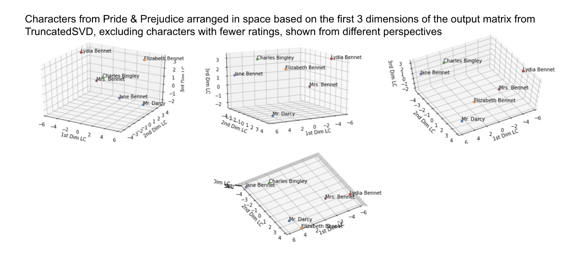

This is an exploratory project I worked on with another graduate student in Data Science II. We explore the space of personality in fictional characters using data from [OpenPsychometrics](https://openpsychometrics.org/tests/characters/). The bulk of the project was spent on probing and describing the space using dimensionality reduction with SVD. A link to the full work is [here](CSYS_387_Final_Paper.pdf).

